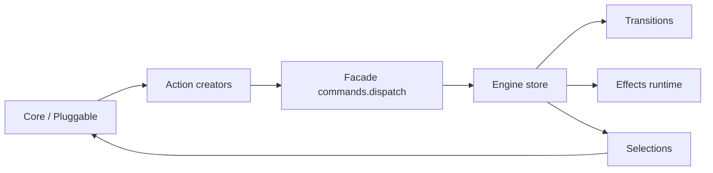

# Engine Docs

Documentacao oficial da engine para o fluxo implementado atualmente (V3 artifact-first).

## Mapa da documentacao

- `core/artifact-first.md`: fluxo principal (`defineCoreKernel` -> `createCoreArtifact` -> `createComposedEngine`).
- `actions/actions.md`: catalogo de actions e eventos tipados.
- `actions/facade.md`: facade com `createFacadeBindings`.
- `transitions/transitions.md`: DSL `defineKernelTransitions`.
- `effects/effects.md`: DSL `defineKernelEffects`.
- `store/slices.md`: slices dinamicos por slot/projection.
- `pluggables/slots.md`: composicao por schema e ciclo de mount/unmount.
- `dispatch/dispatch.md`: regra transitions-only write.
- `devtools/devtools.md`: estado atual do modulo devtools na engine.
- `implementation-examples.md`: exemplos ponta a ponta com o contrato atual.

## Regra principal

Somente transitions mudam o estado.

## Referencias de codigo

- Kernel e helpers base: `libs/ui-state/src/lib/engine/core/core-kernel.ts`
- Artifact e DSL de transitions/effects: `libs/ui-state/src/lib/engine/core/core-artifact.ts`
- Runtime do core composto: `libs/ui-state/src/lib/engine/core/composed-engine.ts`
- Bindings de facade: `libs/ui-state/src/lib/engine/core/facade-bindings.ts`
- Exemplo movie-search:
  - `apps/demo-app/src/app/movie-search/store/movie-search.kernel.ts`
  - `apps/demo-app/src/app/movie-search/store/movie-search.artifact.ts`
