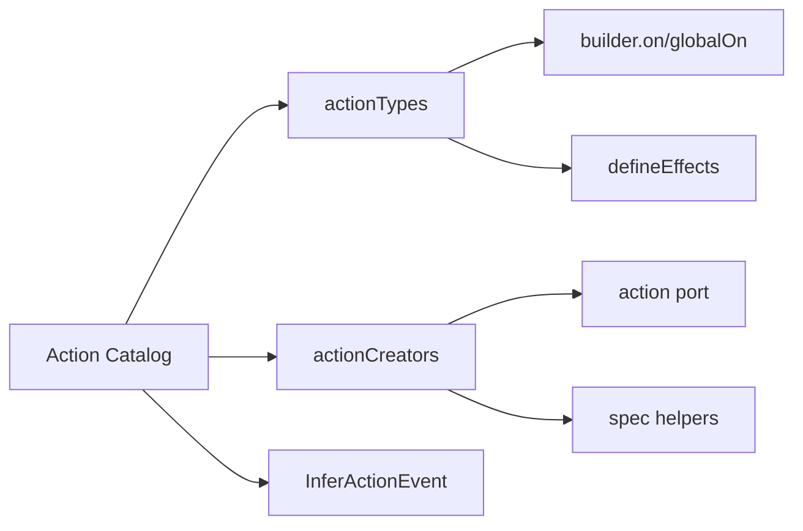

# Actions e Eventos Tipados

## Objetivo

Actions sao a entrada da maquina de estado. Elas representam intencao de negocio, nao mutacao direta.

## Padrao recomendado

Use `defineActionCatalog` para centralizar ids de eventos e creators.

Referencia de implementacao:

- API da engine: `libs/ui-state/src/lib/engine/store/action-catalog.ts:37`
- Exemplo real: `apps/demo-app/src/app/movie-search/store/movie-search.actions.ts:1`

## Exemplo

```ts
const cardActionCatalog = defineActionCatalog({
  load: {
    type: 'card/load',
    payload: (cardId: string) => ({ cardId }),
  },
  loadSuccess: {
    type: 'card/loadSuccess',
    payload: (data: CardDto) => ({ data }),
  },
  loadError: {
    type: 'card/loadError',
    payload: (message: string) => ({ message }),
  },
});

type CardEvent = InferActionEvent<typeof cardActionCatalog>;
```

## Beneficios

- Evita string solta repetida em varios arquivos.
- Melhora IntelliSense para `types` e `creators`.
- Gera union de eventos automaticamente, sem duplicar definicao.

## Fluxo recomendado

1. Criar catalogo de actions no dominio (`store/<feature>.actions.ts`).
2. Exportar `types`, `creators` e `Event` derivado.
3. Usar `types` em transitions/effects.
4. Usar `creators` em facade e tests.



## Anti-patterns

- Declarar `type: '...literal...'` espalhado em effects/transitions/tests.
- Manter union manual de eventos separada do catalogo.
- Criar action creator fora do catalogo.

## Checklist rapido

- [ ] Existe um arquivo unico de catalogo por feature.
- [ ] Eventos sao derivados por `InferActionEvent`.
- [ ] Nao ha casts `Extract<...>` em transitions/effects.
- [ ] Tests usam `actionCreators` para criar eventos.
