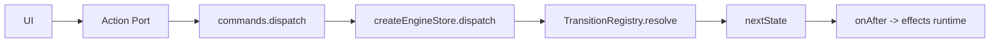

# Dispatch e Regras de Escrita

## Regra central

Estado so muda por transition resolvida via dispatch.

Referencias:

- API de commands: `libs/ui-state/src/lib/engine/store/engine.types.ts:113`
- Implementacao de dispatch na facade: `libs/ui-state/src/lib/engine/facade/engine.facade.ts:79`
- Reducer/store runtime: `libs/ui-state/src/lib/engine/store/engine.reducer.ts:28`

## Quais dispatchs existem

- `dispatch(event)`: um evento.
- `dispatchMany(events)`: lote sequencial.
- `context.dispatch(event)`: dentro de effect.

## Onde usar

- UI/pluggable -> action port da facade.
- Effects -> `context.dispatch` para encadear fluxo.
- Nunca mutar sinal de estado manualmente fora do runtime.

## Diagrama

## Checklist de seguranca

- [ ] Componentes nao acessam internals de registries.
- [ ] Nao existe `state.set(...)` fora da engine.
- [ ] Dispatch usa eventos do catalogo (`actionCreators`/`actionTypes`).
