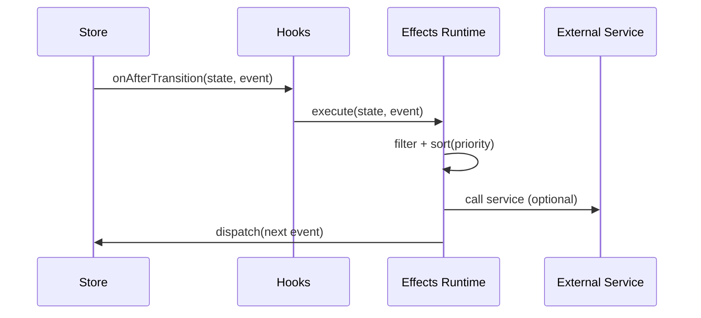

# Effects

## Objetivo

Effects tratam side effects apos uma transition: HTTP, logs, telemetria e encadeamento de eventos.

Referencias:

- Tipo de effect e narrowing por evento: `libs/ui-state/src/lib/engine/store/engine.types.ts:86`
- Helper `defineEffects`: `libs/ui-state/src/lib/engine/effects/define-effects.ts:3`
- Runtime de execucao com prioridade: `libs/ui-state/src/lib/engine/effects/engine-effects.runtime.ts:30`
- Registro e dedupe por `id`: `libs/ui-state/src/lib/engine/registries/effect.registry.ts:24`

## Ordem de execucao

1. Transition roda e produz `nextState`.
2. Hook `onAfterTransition` chama runtime de effects.
3. Runtime filtra por `event`, aplica `when`, ordena por `priority`.
4. Handler recebe `state`, `event` narrow e `context` (`dispatch`, `getState`, `services`).

## Exemplo real

`apps/demo-app/src/app/movie-search/store/movie-search.effects.ts:1`

- Effect `submit` executa busca mock e dispara `loading/success/error`.
- Effect `selectItem` sincroniza carregamento de detalhes.

## Diagrama

## Regras recomendadas

1. Effect deve ser idempotente quando possivel.
2. Sempre tratar erro e disparar evento de falha.
3. Evitar logica de transformacao de estado no effect.
4. Usar `actionTypes` do catalogo em vez de literal string.

## Checklist

- [ ] Todos os handlers async tratam excecao.
- [ ] Eventos de erro existem e sao tratados em transitions.
- [ ] Prioridade definida quando houver dependencia entre effects.
