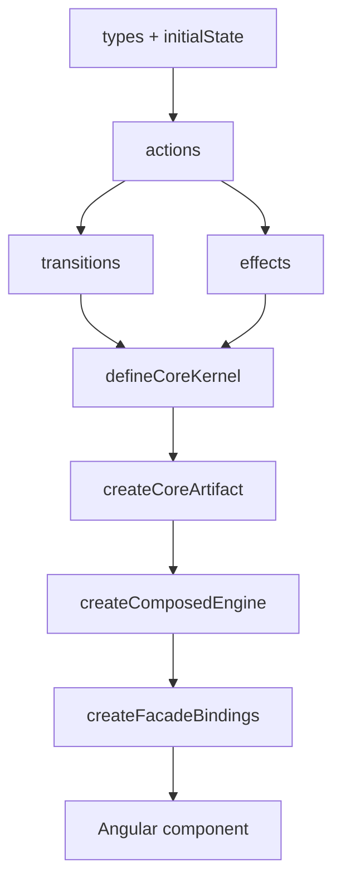

# Exemplos de Implementacao

Fluxo real com a API atual (artifact-first), usando o exemplo `movie-search`.

## Ordem recomendada

1. Definir `types` e `initialState`.
2. Definir `actions` com `defineActionCatalog`.
3. Definir `transitions` com `defineKernelTransitions`.
4. Definir `effects` com `defineKernelEffects`.
5. Definir `selections`.
6. Montar `kernel` (`defineCoreKernel`).
7. Montar `artifact` (`createCoreArtifact` + `createComposition`).
8. Subir `core` (`createComposedEngine`) e bindings (`createFacadeBindings`).

## Exemplo A: core principal

Arquivos de referencia:

- `apps/demo-app/src/app/movie-search/store/movie-search.types.ts`
- `apps/demo-app/src/app/movie-search/store/movie-search.actions.ts`
- `apps/demo-app/src/app/movie-search/store/movie-search.transitions.ts`
- `apps/demo-app/src/app/movie-search/store/movie-search.effects.ts`
- `apps/demo-app/src/app/movie-search/store/movie-search.selections.ts`
- `apps/demo-app/src/app/movie-search/store/movie-search.kernel.ts`
- `apps/demo-app/src/app/movie-search/store/movie-search.artifact.ts`

Pontos importantes:

1. `withSlot('input' | 'results' | 'details', ...)` monta UI plugavel.
2. `sliceInitialState` cria slices `state().input`, `state().results`, `state().details`.
3. `withChildCore('history', ...)` + `connectChild(...)` projeta `historyProjection`.

## Exemplo B: child core com projection

Arquivos de referencia:

- `apps/demo-app/src/app/movie-search/history-core/store/history.kernel.ts`
- `apps/demo-app/src/app/movie-search/history-core/history-core.artifact.ts`
- `apps/demo-app/src/app/movie-search/history-core/history-core.component.ts`

Pontos importantes:

1. child core tem store e actions proprias.
2. pai so enxerga projection resumida (`historyProjection`), nao store completa do filho.
3. comunicacao pai-filho e por links de actions (`link(parent.actions.x, child.actions.y)`).

## Exemplo C: facade curta para o app

Arquivo de referencia:

- `apps/demo-app/src/app/movie-search/facade/movie-search-facade.service.ts`

Padrao:

1. `core = createComposedEngine(artifact)`.
2. `bindings = createFacadeBindings(core)`.
3. expor apenas `state`, `actions`, `selections`, `composition`, `destroy`.

## Checklist rapido

- [ ] Nenhuma mutacao de estado fora de transition.
- [ ] Nenhum string literal de evento fora do action catalog.
- [ ] Slices de slot acessados por `state().<slotName>`.
- [ ] Projection de child acessada por `state().<slotName>Projection`.
- [ ] Cleanup chamado no `ngOnDestroy`.
