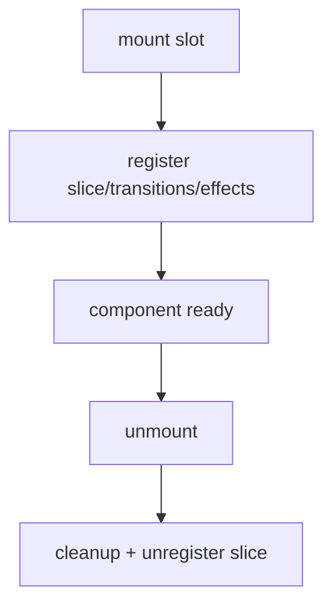

# Slots e Pluggables

## Objetivo

Slots permitem montar UI plugavel sem acoplamento entre componentes filhos.

## API implementada

Composicao tipada por schema:

```ts
const schema = defineCompositionSchema({
  input: requiredSlot<InputConfig>(),
  results: requiredSlot<ResultsConfig>(),
});

const composition = createComposition(schema)
  .withSlot(
    'input',
    InputPluggableComponent,
    { placeholder: 'Buscar' },
    {
      sliceInitialState: { lastSubmittedTerm: null },
    },
  )
  .withSlot('results', ResultsPluggableComponent, { emptyMessage: 'Sem resultados' })
  .build();
```

Referencias:

- Builder tipado: `libs/ui-state/src/lib/engine/pluggables/composition.builder.ts`
- Diretiva de mount/unmount: `libs/ui-state/src/lib/engine/pluggables/slot.directive.ts`
- Exemplo real: `apps/demo-app/src/app/movie-search/store/movie-search.artifact.ts`

## Ciclo de vida

1. slot monta componente;
2. slot registra artifacts (`slice`, `transitions`, `effects`) se existirem;
3. no unmount faz cleanup completo;
4. se slice foi registrado, ele e removido da store.



## Regras

1. pluggable nao altera estado por fora do facade/dispatch;
2. comunicacao entre filhos acontece via estado/comandos do core;
3. `slot` e `projection` usam chaves estaveis.
